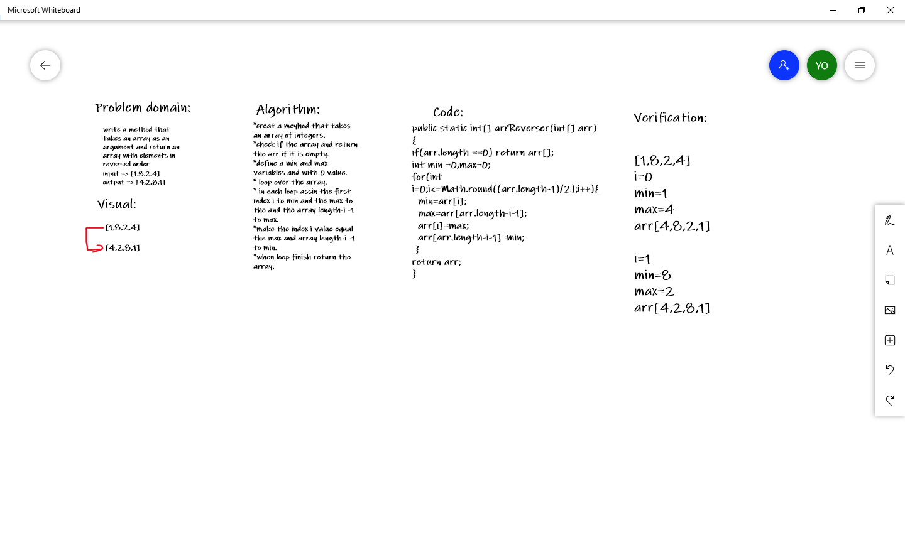

# Reverse an Array

**write a method that takes an array as an argument and return an array with elements in reversed order.**

## Whiteboard Process

## Approach & Efficiency
<!-- What approach did you take? Discuss Why. What is the Big O space/time for this approach? -->