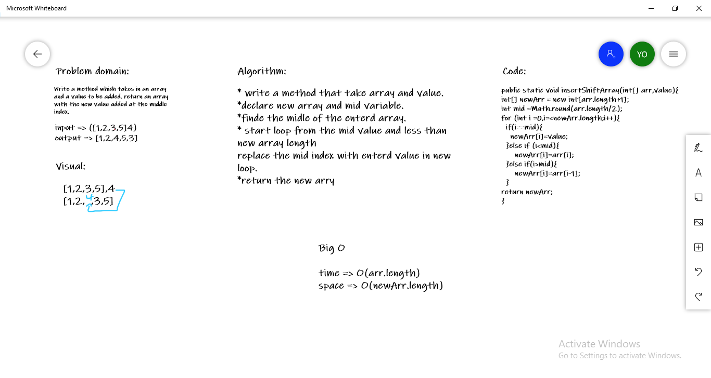

# Insert to Middle of an Array

**Write a method which takes in an array and a value to be added. return an array with the new value added at the middle index.**

## Whiteboard Process

## Approach & Efficiency

**time was the length of the arr+1**
**space (arr.length+1)** **because of** **the new array.**