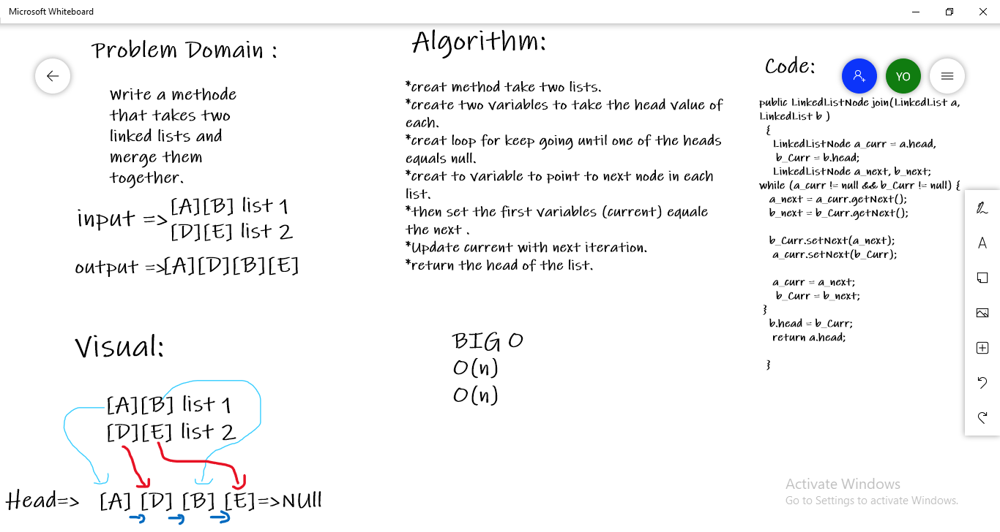

# Zip two linked lists.
Write a methode that takes two linked lists and merge them together.

## Whiteboard Process

## Approach & Efficiency
current pointer and next to get the linkup a head and need three variables since the first list head will not change
