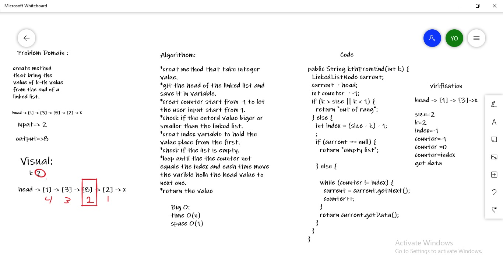

# challenge 7 k-th value from the end of a linked list.
**create method that bring the value of k-th value from the end of a linked list.** 

**enter value from starting from to get the value if this number from the end of the list** 
**the number refer to the place of the node from the end of the list**
**the code in ch5 package** 

## white board

