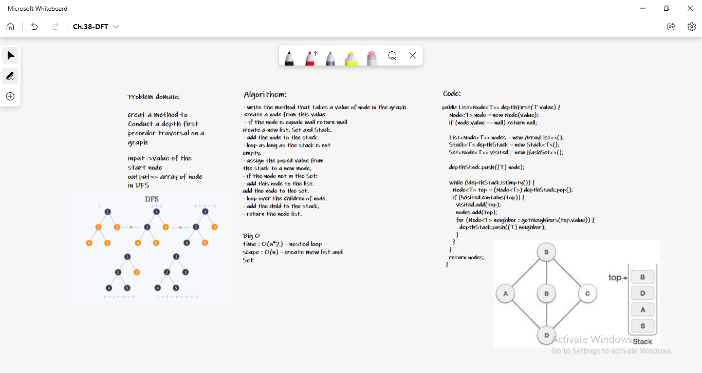

# Graphs
Learning a new data structure: graphs.

## Challenge
**Conduct a depth first preorder traversal on a graph**
* depthFirst(T value) - Returns array of the DFS order

## Approach & Efficiency

*depthFirst(T value) space O(n) array length/ time O(n^2) nested loop

