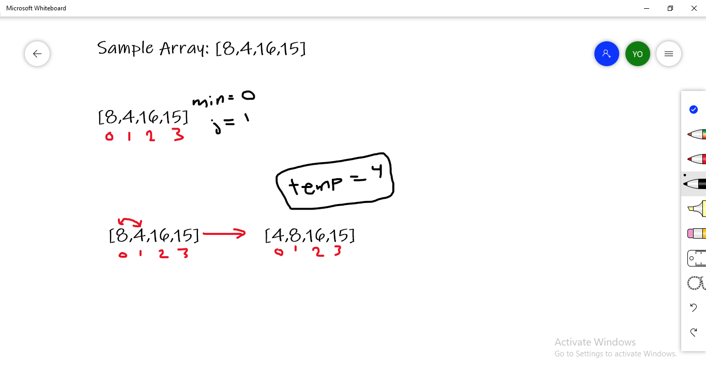
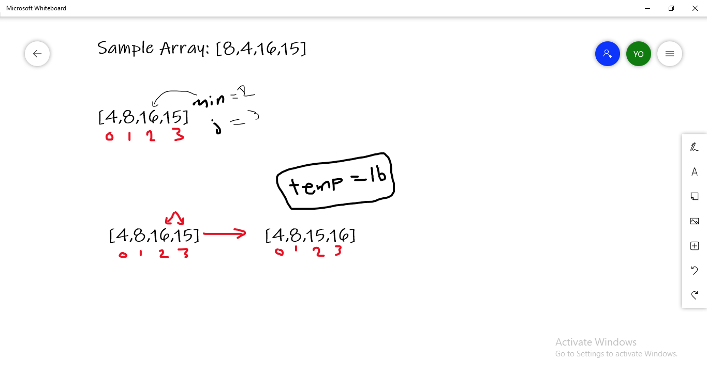
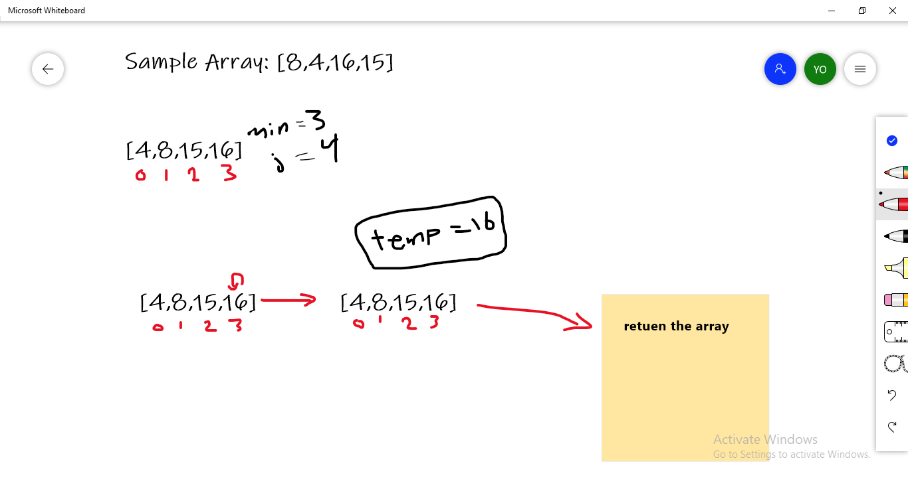

# Insertion Sort


## Pseudocode

```java
  InsertionSort(int[] arr)

    FOR i = 1 to arr.length

      int j <-- i - 1
      int temp <-- arr[i]

      WHILE j >= 0 AND temp < arr[j]
        arr[j + 1] <-- arr[j]
        j <-- j - 1

      arr[j + 1] <-- temp
```

## Trace

Sample Array: [8,4,16,15]

**Pass 1:**
min=0;
j=1;

temp=4;

will compare the 4 with 8, when it's less than 8, will assign it equal to 8 and minus 1 from j to become -1 and break the while loop.

then assign arr[j+1] the value of temp which is 4.



**Pass 2:**
min=1;
j=1;

temp=8;

while temp is == 8  will move to the next iteration.


**Pass 3:**
min=2;
j=3;

temp=16;

while temp is grater than 15 will assign 15 to the previous



**Pass 4:**
min=3;
j=4;

temp=16;

will temp == 16 keep the same



*
## Efficency

- **Time: `O(n^2)`:**

  The basic operation of this algorithm is comparison. This will happen `n*(n-1)` number of times…concluding the algorithm to be n squared.

- **Space: `O(1)`:**

  No additional space is being created. This array is being sorted in place…keeping the space at constant `O(1)`.
