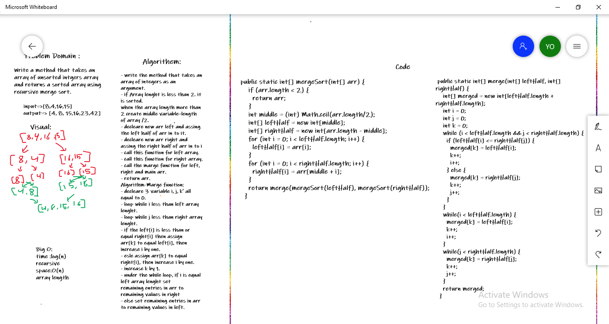

# Merge Sort
**Write a method that takes an array of unsorted intgers array and returns a sorted array using recursive merge sort.**

## Whiteboard Process
 
[Blog](BLOG.md)

## Approach & Efficiency
**translate the pseudocode**

