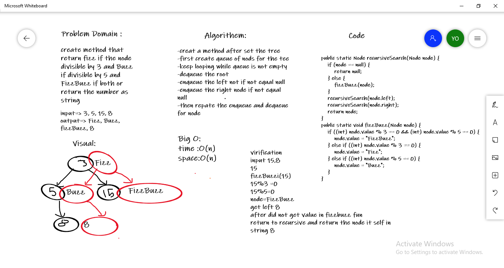

# FizzBuzz

## Challenge

+ **Write a function called fizz buzz tree** 
+ **Arguments: k-ary tree** 
+ **Return: new k-ary tree.** 
+ **If the value is divisible by 3, replace the value with “Fizz”** 
+ **If the value is divisible by 5, replace the value with “Buzz”** 
+ **If the value is divisible by 3 and 5, replace the value with “FizzBuzz”** 
+ **If the value is not divisible by 3 or 5, simply turn the number into a String.** 

## Whiteboard

