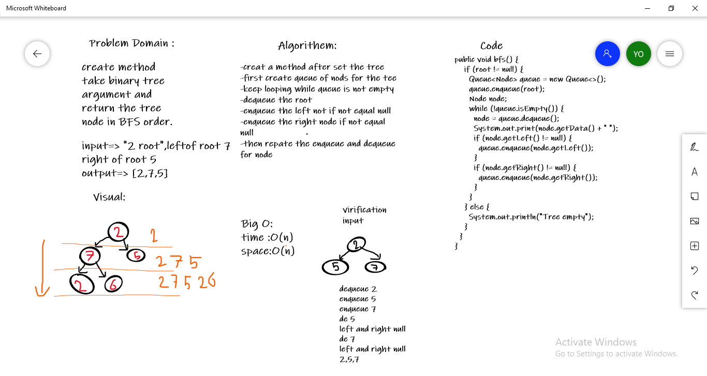

# Breadth-first Traversal.
**A tree whose elements have at most 2 children is called a binary tree. Since each element in a binary tree can have only 2 children, we typically name them the left and right child.**

## Challenge

+ **Write a function called breadth first** 
+ **in order** 
+ **Arguments: tree.** 
+ **Return: list of all values in the tree, in the order they were encountered** 

## Whiteboard

